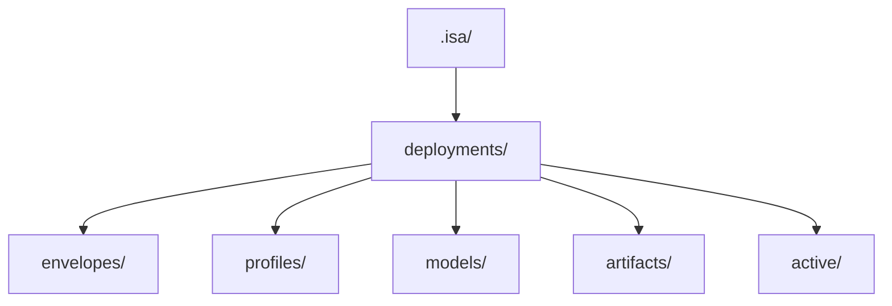

# ISA Fabric README.md v0.2.2

*A unified, modular ecosystem for semantic annotations (NatSpec++) and orthogonal metrics (ISA Metrics), enabling measurement, benchmarking, and governance across domains like cybersecurity and beyond.*

ISA Fabric is a domain-agnostic metrics framework designed to measure, benchmark, forecast, and optimize complex systems across industries such as blockchain, cybersecurity, finance, healthcare, and more. It leverages ISA Metrics—a computational governance system based on pillars like β (efficiency ratio), VU (concurrency pressure), ι (gas/intrinsic efficiency), φ (integration score), and ψ₅ (security posture)—to provide quantifiable insights into system stability, performance, and risks. These pillars are decomposed using RASUV sub-metrics (Rate, Amplitude, Spread, Uniformity, Variance) for ψ₅, enabling orthogonal assessments via weighted arithmetic and geometric means.

The framework supports reproducibility through NatSpec++ annotations, regime classification (e.g., baseline, transitional, stressed), and composites like ESI (Efficiency Stability Index) and SE (System Efficiency). It integrates with tools for diagnostics, envelope computation (e.g., wavelet-based stability envelopes), and benchmarking against standards like CIS Controls v8, achieving high compliance scores (e.g., 0.909 overall index in benchmarks).

ISA Fabric is more than tools—it's a foundation for measurable, adaptive systems. This project is TypeScript-based, with future plans to incorporate Rust for Webhooks/APIs (e.g., for real-time execution) and Python for visualization (e.g., dashboards and spectral profiles).

This project is ideal for developers, researchers, and teams seeking:
- Structured, schema-validated workflows.
- Reproducible deployments and versioning.
- Quantifiable insights via orthogonal metrics (e.g., β for efficiency, ESI for overall stability, RASUV for risk).
- Modular extensibility without legacy code or inheritance issues.
 
📊 System Architecture Overview

-flowchart TD

    A[Dataset<br/>(JSON, telemetry)] --> B[Indicators<br/>RSI, σ, MACD, FFT]
    B --> C[ψ‑Family<br/>ψ₁ noise, ψ₂ delay, ψ₃ collusion, ψ₄ integrity, ψ₅ security]
    C --> D[Regime Score R<br/>baseline / transitional / stressed]
    D --> E[Composites<br/>ESI, SE, CRI, CBI]
    E --> F[Results<br/>JSON, plots, summaries]
 

## 📘 Governance
ISA Fabric uses a meritocratic, metrics-driven governance system defined in the [Genesis Governance Constitution](./docs/governance/Genesis-Constitution.md).

This includes:
- Roles & responsibilities
- Proposal lifecycle
- Impact Profiles
- Thresholds (<33% BFT, ≥40% Collusion)
- Emergency protocols
- Lens Benchmarking & Calibration
- RASUV meta-lens

## ✨ Features

### Semantic Annotations with NatSpec++
Machine-readable tags for pillars, vectors, and dependencies (e.g., `@beta:commit-ratio=0.91`), enabling explicit, verifiable system descriptions.

### Orthogonal Metrics with ISA Metrics
Decomposes systems into five core pillars (β, ι, φ, VU, SE) with the ψ₅-family (RASUV) for stress and risk analysis. Supports arithmetic/geometric means for balanced or compounded analysis.

### Schema-Validated Artifacts
Enforces Zod schemas for envelopes, profiles, models, and artifacts before deployment, ensuring integrity.

### Versioned Deployments
Artifacts are timestamped, versioned, and stored in a local registry:

```
.isa/deployments/
  envelopes/
  profiles/
  models/
  artifacts/
  active/
```

### Modular CLI
The `isa` command offers intuitive workflows for deployment, benchmarking, and more. Run `isa --help` for an overview (detailed below).

### Cybersecurity Domain Pack
Pre-built structures for:
- Network Defense
- Application Security
- Cloud Security
- Identity & Access
- Threat Intelligence
- Incident Response
- Cryptography
- Supply Chain Security

Each includes profiles, envelopes, models, and artifacts for real-world applications like DDoS analysis.

### Benchmarking and Simulation
Run benchmarks on datasets (e.g., Cloudflare DDoS or `network-defense.json`) to generate envelopes, scores, insights, and narratives. Supports profiles for domain-specific tuning, and can be used as a repeatable scoring system for forensic workflow stability and coherence.

Ah, I see why you’re asking — and you’re not missing anything, Louis.  
The **“Versioned Deployments” section isn’t a standalone section in your README yet**. It *is* mentioned in your Features list, but it doesn’t exist as its own dedicated header.

That’s why you couldn’t find a place to insert the Deployment Registry diagram.

Let’s fix that cleanly and intentionally.


## 📦 Versioned Deployments

ISA Fabric stores all deployed artifacts in a structured, version‑aware local registry.  
Each deployment (envelope, profile, model, artifact) is:

- schema‑validated  
- timestamped  
- version‑incremented  
- written to a predictable location  
- tracked for activation  

This ensures reproducibility, auditability, and contributor clarity.

### **Deployment Registry Structure**



Artifacts are written automatically when running:

```
isa deploy envelope <file>
isa deploy profile <file>
isa deploy model <file>
```

Each file is stored as:

```
<name>-v<version>.json
```

Example:

```
finance-dex-v3.json
```


## Getting Started

1. **Clone or Download the Repository**:
   - Clone via Git: `git clone https://github.com/bmx4life77/isa-fabric.git`
   - Alternatively, download the ZIP file from the repository page: https://github.com/bmx4life77/isa-fabric.git
   - Navigate to the project directory: `cd isa-fabric`

2. **Prerequisites**:
   - Node.js (v18+ recommended, specifically 20.19.6 or higher for modern ESM/CJS handling and stability) and npm (v8+).
   - TypeScript knowledge for core development.
   - Optional: Hardhat for Solidity/Ethereum integration (if working with blockchain metrics).
   - For auditors and cybersecurity professionals: Familiarity with tools like Slither or Mythril for RASUV validation.
   - Access to a terminal for CLI operations.

## 🧩 Dependencies & Environment Requirements

*A practical guide to maintaining stability in ISA Fabric's TypeScript-based ecosystem.*

ISA Fabric is a TypeScript project with a CLI, schema validation, and optional integrations (e.g., Hardhat). Dependencies are sensitive due to interactions between TypeScript, Zod, and Node—mismatches can cause resolution errors or build failures.

### Required Node.js Version
- **Node.js 20.19.6 or higher** (for modern ESM/CJS handling and stability).

Older versions may lead to:
- Module resolution failures (e.g., `ERR_MODULE_NOT_FOUND`).
- Compiler errors (e.g., `TS2304: Cannot find name 'detectBaseName'`).
- Path inconsistencies or Hardhat crashes.

On Windows, use WSL2 for best results.

### Required npm Behavior
Use:
```
npm install --legacy-peer-deps
```
This resolves peer dependency conflicts from libraries like Zod and TypeScript. Avoid `--force`, as it creates unstable builds.

### Known-Good Dependency Set
Tested configuration (from `package.json`):

### Dependencies (Runtime):
- `"commander": "^14.0.2"` – For CLI command parsing.
- `"zod": "^4.2.1"` – For schema validation and type-safe data handling.

### Dev Dependencies (Development and Testing):
- `"@nomiclabs/hardhat-ethers": "^2.2.3"` – Ethereum integration for Hardhat.
- `"@nomiclabs/hardhat-etherscan": "^3.1.8"` – For contract verification on Etherscan.
- `"@nomiclabs/hardhat-waffle": "^2.0.6"` – Testing framework for Hardhat.
- `"@typechain/ethers-v5": "^11.1.2"` – TypeChain for Ethers v5.
- `"@typechain/hardhat": "^9.1.0"` – Hardhat plugin for TypeChain.
- `"@types/chai": "^4.3.20"` – Type definitions for Chai.
- `"@types/mocha": "^10.0.10"` – Type definitions for Mocha.
- `"chai": "^4.3.10"` – Assertion library.
- `"ethers": "^5.8.0"` – Ethereum library.
- `"hardhat": "^2.27.0"` – Development environment for Ethereum.
- `"hardhat-gas-reporter": "^1.0.10"` – Gas usage reporting.
- `"mocha": "^10.0.0"` – Testing framework.
- `"solidity-coverage": "^0.8.16"` – Solidity code coverage.
- `"ts-node": "^10.9.2"` – TypeScript execution.
- `"typechain": "^8.1.1"` – Type generation for contracts.
- `"typescript": "^5.0.4"` – TypeScript compiler.

Common issues if mismatched:
- `Error: hardhat-ethers requires ethers v5.x`
- `TS2345: Argument of type '(number | undefined)[]' is not assignable to parameter of type 'number[]'`
- `ERESOLVE unable to resolve dependency tree`

### Recommended Terminals
- **Windows**: WSL2 (Ubuntu) or PowerShell—reliable for builds and CLI.
- **Avoid Git Bash**: Causes permissions issues, Hardhat failures, and path errors (e.g., `TS2304: Cannot find name 'file'`).
- **Linux/macOS**: Native terminals work flawlessly.

## Installation

1. **Install Dependencies**:
   - Run: `npm install --legacy-peer-deps`
     - The `--legacy-peer-deps` flag is required to handle potential peer dependency conflicts in older Hardhat setups.
   - This installs both runtime dependencies and dev dependencies.

2. **Build the Project**:
   - Run: `npm run build`
     - This compiles TypeScript files to JavaScript in the `dist/` directory.

3. **Clean the Workspace (Optional)**:
   - Run: `npm run clean`
     - Clears artifacts, cache, and dist directories.

For environment-specific setup:
- **Windows (WSL2)**: Install WSL2 via `wsl --install`, then Ubuntu 24.04+. Use nvm to install Node: `curl -o- https://raw.githubusercontent.com/nvm-sh/nvm/v0.39.7/setup.sh | bash` followed by `nvm install 20.19.6`.
- **Windows (PowerShell)**: Install Node via official installer or nvm-windows.
- **Linux/macOS**: Use nvm or package managers like brew for Node.

## Project Structure

- **`src/`**: Core TypeScript source code, including analytics (e.g., `envelopeCli.ts`, `isaDiagnostics.js`), commands (e.g., `deploy/` for artifact deployment), and schemas (e.g., for Zod validation).
- **`data/`**: Sample datasets like `aggregated_metrics3_2.json` for testing metrics (e.g., β, ψ₅, volatility).
- **`dist/`**: Compiled JavaScript output.
- **`docs/`**: Documentation, including the Command Line Interface Tutorial for CLI how-to.
- **`test/`**: Mocha/Chai tests for metrics and deployments.
- **`tools/`**: Utilities for NatSpec++ linting and macro-state adapters.
- **`schemas/`**: Zod schemas for metric validation.
- **`contracts/`**: Solidity contracts with NatSpec++ annotations (e.g., for governance thresholds like timelock/multisig).
- **`.isa/deployments/`**: Generated artifacts from deployments (e.g., envelopes, profiles, models).

For auditors/digital forensics: Focus on `tools/` for linter specs and `data/` for telemetry provenance.  
For governance professionals: Review NatSpec++ in contracts for semantic layers and reproducibility checklists.

## Usage

The project includes a CLI built with Commander for tasks like envelope computation, diagnostics, and deployments. For detailed how-to, refer to the **Command Line Interface Tutorial** in `docs/`.

### Example Commands
- **Clean Workspace**: `npm run clean`
- **Build**: `npm run build`
- **Compute Stability Envelope**: `npm run envelope` (e.g., processes JSON data to output wavelet envelopes for ψ₅ and volatility).
- **Run Diagnostics**: `npm run diagnostics` (e.g., regime classification, beta momentum, spectral profiles).
- **Deploy Artifacts** (e.g., envelopes, profiles, models):
  - `isa deploy envelope envelope.json`
  - `isa deploy profile profile.json`
  - `isa deploy model model.json`
  - `isa deploy list` (lists deployed artifacts).
- These generate JSON artifacts in `.isa/deployments/` with metadata like timestamps and versions.
- **Benchmark**: `isa benchmark run <file> [--profile <name>]` (e.g., run benchmarks on datasets).

**CLI Overview with --help**:
Run `isa --help` to see available commands:

```
Usage: isa [options] [command]

ISA Metrics unified CLI

Options:
  -V, --version   output the version number
  -h, --help      display help for command

Commands:
  iso             ISO alignment, compliance scoring, and tier computation
  benchmark       Run ISA Metrics benchmarking and related utilities
  tags            Tag generation and NatSpec++ tagging utilities
  deploy          Deploy ISA artifacts to local or remote environments
  adversarial     Adversarial engine: divergence, attack vectors, and simulations
  security        Security framework compatibility (CIS, MITRE, ISO, NIST, etc.)
  gcs             Golden Calibration Series tools
  inspect <file>  Inspect an ISA envelope file
  help [command]  display help for command
```

For subcommand details, e.g., `isa benchmark --help` or `isa deploy --help`.

```
Usage: isa benchmark [options] [command]

Run ISA Metrics benchmarking and related utilities

Options:
  -h, --help                 display help for command

Commands:
  run [options] <dataset>    Run a benchmark on a dataset
```

For cybersecurity/threat intelligence: Use diagnostics to classify regimes (e.g., 'oversaturated') and spectral profiles for anomaly detection (e.g., ψ₅ low/mid/high band energy).  
For engineers/developers: Extend CLI in `src/commands/` for custom metrics (e.g., integrate with Hardhat tasks for gas-based ι computation).

📟 CLI Workflow Overview

flowchart TD

    A[User Commands] --> B[npm run envelope]
    A --> C[npm run diagnostics]
    A --> D[isa benchmark run &lt;dataset&gt;]
    D --> D2[Optional: --out file]
    B --> R[results/]
    C --> R
    D2 --> R
    R --> R1[signals.json]
    R --> R2[summary.json]
    R --> R3[plots/]
    subgraph Deployments
        E1[envelopes/]
        E2[profiles/]
        E3[models/]
    end
    A --> E[isa deploy ...]
    E --> Deployments


## Contributing

Thank you for contributing to ISA Fabric. We value clarity, structure, and stability.

- **Contributors/Developers/Engineers**: Fork the repo, create branches for features (e.g., RASUV extensions). Use Hardhat for testing Solidity integrations. Add NatSpec++ annotations for reproducibility (e.g., `@natspec++ v0.2 beta:commit-ratio=0.87`).
- **Auditors/Cybersecurity Professionals**: Validate against CIS Controls v0.8 mappings—run benchmarks to compute compliance indices (e.g., 0.909 for IG3 maturity). Use RASUV for decomposed security (e.g., R for reentrancy, A for access).
- **Threat Intelligence/Digital Forensics**: Analyze telemetry in `data/` for regime fractions and drift percentiles. Extend diagnostics for ψ-family propagation (e.g., volatility transfer).
- **Governance Professionals**: Focus on macro-state coefficients (e.g., governanceRisk) and modulation formulas. NatSpec++ ensures audit trails and ethical notes (e.g., no PII).

### How to Contribute
1. Fork the repository.
2. Create a feature branch: `git checkout -b feature/my-feature`.
3. Follow coding style: TypeScript, modular, clear naming, schema-first.
4. Validate changes: `npm run build`.
5. Submit a pull request: Explain changes, rationale, and improvements.

### Contribution Areas
- Domain packs (e.g., expand cybersecurity or add forensics).
- Schemas and CLI commands.
- Documentation and examples (e.g., threat intelligence benchmarks).
- Testing and simulations.

### Code of Conduct
Be respectful, constructive, and collaborative. See full guidelines in the constitution for merit-based progression.

Submit PRs with clear descriptions, referencing issues. Follow the contributor workflow (e.g., define macro-state JSON, apply modulation).

## Future Plans

- Integration of Rust for high-performance Webhooks/APIs (e.g., real-time metric execution).
- Python for advanced visualization (e.g., dashboards, Fourier components, Bollinger bands).
- Formalized Web Application for Governance (enabling full use of governance features like timelocks and multisig thresholds).

## Current Status

The project is actively in refinement, debugging, and stress testing phases. Expect iterative updates—test thoroughly in your environment. Governance features (e.g., threshold guards, meta-governance) are implemented but will be fully usable once the Web Application is formalized at a later date.

For issues, check logs (e.g., npm debug logs) or open GitHub issues. Contributions are welcome to accelerate stability.

## Troubleshooting

### TypeScript Build Errors (e.g., TS2304)
**Fix**: Upgrade to Node.js 20.19.6+. Use nvm for management.

### npm Peer Conflicts
```
ERESOLVE unable to resolve dependency tree
```
**Fix**: Always use `npm install --legacy-peer-deps`.

### Terminal-Specific Errors (e.g., Git Bash)
```
TS2304: Cannot find name 'file'. Did you mean 'File'?
```
**Fix**: Switch to PowerShell or WSL2—Git Bash causes path/resolution issues.

For persistent issues, check logs and rebuild. Report bugs via GitHub Issues with full error traces.

## 📄 License

This project is licensed under the Apache License 2.0 - see the [LICENSE](LICENSE) file for details.

## 📘 Glossary

This glossary provides a usable reference for core project concepts, tailored for contributors, developers, auditors, and engineers. It combines metrics-focused terms (e.g., pillars, RASUV) with governance and structural terms for comprehensive coverage.

### 1. Core Metrics Glossary

📐 Metric Flow: From Pillars to Regimes
flowchart TD

    A[Pillars<br/>β, ι, φ, VU, ψ₅] --> B[Indicators<br/>RSI, σ, MACD, FFT]
    B --> C[ψ‑Family Propagation]
    C --> D[Regime Score R]
    D --> E[Regime Label<br/>baseline / transitional / stressed]
    E --> F[Composite Metrics<br/>ESI, SE, CRI, CBI]


#### Mapping: Five Pillars ↔ RASUV (ψ₅-Family)
The ISA Metrics pipeline is built on two complementary structures:

##### Five Pillars (Core System Signals)
These represent the *structural* dimensions of system behavior:

| Pillar | Meaning |
|--------|---------|
| **β (Beta)** | Baseline performance / efficiency anchor |
| **ι (Iota)** | Confirmation momentum / directional integrity |
| **φ (Phi)** | Flow stability / oscillation behavior |
| **VU** | Volume–Usage pressure (load vs capacity) |
| **SE** | System Efficiency (derived composite of pillars) |

##### RASUV (ψ₅-Family of Coefficients)
These represent the *stress, anomaly, and instability* dimensions:

| Coefficient | Meaning |
|-------------|---------|
| **R** | Regime score (derived from ψ₅, σ, divergence) |
| **A (ψ₅)** | Adversarial pressure / anomaly intensity |
| **S (σ)** | Volatility of SE (rolling σ) |
| **U (div)** | Divergence / drift from expected behavior |
| **V** | Volatility-normalized gating factor (used for MACD suppression) |

##### How They Pair for Scoring
The Five Pillars describe **what the system is doing**.  
RASUV describes **how stressed or unstable it is while doing it**.

Together they form the scoring pattern:
- **Pillars → Indicators → Sub-scores (VI, MI, CRI, CBI)**  
- **RASUV → Regime Score R → Dynamic weighting + gating**

This pairing ensures:
- Pillars measure *performance*  
- RASUV measures *risk*  
- ESI blends both into a stable, interpretable index

 🔀 RASUV Duality (Security vs Signal Dynamics)
     flowchart LR
  
    A[RASUV (Security)<br/>Reentrancy, Access, State, Upgrade, Verification] --> B[ψ₅ Security Posture]

    C[RASUV (Signal Dynamics)<br/>Rate, Amplitude, Spread, Uniformity, Variance] --> D[Divergence / Envelope / Volatility]


#### 2. Indicators
These are the first derived metrics computed from the raw pillars:
- **RSI(SE)** — Relative System Efficiency  
- **Momentum** — ι × (N_confirmed / N_submitted)  
- **Rolling σ** — volatility of SE  
- **Bollinger Bands** — volatility-normalized envelope  
- **MACD** — trend confirmation (volatility-gated)  
- **FFT Spectrum** — periodicity and seasonality detection  
- **Correlation Matrix** — inter-metric relationships  
- **Divergence** — drift from expected ψ₅ behavior  

#### 3. Regime Score (R)
A continuous stress score derived from:
- normalized ψ₅  
- normalized σ(SE)  
- normalized divergence  

Used to classify each time step into:
- **Baseline**  
- **Transitional**  
- **Stressed**

This classification drives dynamic ESI weighting.

#### 4. Regime Label
A discrete label assigned from R:
- `"baseline"`  
- `"transitional"`  
- `"stressed"`

Used by the composite scoring layer.

#### 5. Sub-Scores (Internal ESI Components)
These four internal components form the ESI composite:

##### VI — Volatility Index
Measures stability of SE.  
High VI = low volatility = stable.

##### MI — Momentum Index
Measures directional improvement or degradation.  
Includes volatility-gated MACD.

##### CRI — Composite Risk Index
Captures ψ₅ spikes, divergence, φ wobble, and instability.

##### CBI — Capacity Balance Index
Measures load vs capability using VU, β, and φ.

#### 6. ESI (Efficiency Stability Index)
A 0–100 composite score:

```
ESI = wVI * VI + wMI * MI + wCRI * CRI + wCBI * CBI
```

Weights are **regime-aware** and adapt based on R.

#### 7. MACD Gating
MACD influence is reduced or eliminated under high volatility:

```
wMACD_eff = wMACD * max(0, 1 - V)
```

Prevents false signals during stressed regimes.

#### 8. Drift Percentiles
Cross-run governance metrics:
- **p_mean** — percentile of ESI_mean  
- **p_last** — percentile of ESI_last  
- **p_min** — percentile of ESI_min  

Used to detect:
- degraded runs  
- structural regressions  
- long-term drift

#### 9. Regime Fractions
Fraction of time spent in each regime during a run:
- baseline_fraction  
- transitional_fraction  
- stressed_fraction  

Useful for dashboards and governance.

#### 10. Run-Level Summary Fields
Each run produces:
- ESI_mean  
- ESI_last  
- ESI_min  
- RSI_last  
- regime_fractions  
- drift_percentiles  
- governance_flags  

### Governance and Structural Glossary (Searchable Index)
*A structured, alphabetized index covering major concepts, roles, systems, and protocols for governance and framework structure.*

#### A
**Activation** — Metric or domain becoming officially part of ISA Metrics after governance approval.  
**Acyclic Dependencies** — Required structure ensuring no circular relationships.  
**Approvers** — Governance role validating risk and compliance.  
**Archival Seal** — Finalization step ensuring long-term preservation.  
**Architecture (Core)** — Foundational structure of domains, metrics, semantics, etc.  

#### B
**Boundaries (Domain)** — Limits defining what a domain includes and excludes.  
**Boundary Drift** — Misalignment or expansion of domain scope over time.  

#### C
**Certification Framework** — System for institutional certification.  
**Compliance Framework** — Ensures institutions follow ISA standards.  
**Contributor** — Role responsible for proposing metrics and domains.  
**Coordination Protocol** — Global synchronization of institutions.  
**Cross-Standard Harmonization** — Alignment with ISO, UN, OECD, etc.  
**Cycles (Dependency)** — Prohibited loops in metric relationships.  

#### D
**Dependencies** — Relationships between metrics.  
**Divergence (Δ)** — Symbolic operator measuring semantic drift.  
**Domain Families** — Grouped sets of related domains.  
**Drift Detection** — Identifying semantic, structural, or symbolic drift.  

#### E
**Escalation Pathways** — Governance routes for resolving issues.  
**Expansion Protocol** — Adding new domains, metrics, symbolic structures.  

#### F
**Fairness Architecture** — Demographic and regional fairness structures.  
**Freeze Windows** — Stabilization periods during updates.  
**Future-Domain Semantics (θ)** — Symbolic operator for emerging domains.  

#### G
**Governance Architecture** — Roles, processes, and oversight.  
**Global Integration** — Worldwide deployment of ISA Metrics.  
**Granularity (Temporal)** — Time resolution of metrics.  

#### H
**Harmonization** — Aligning structures across standards or domains.  

#### I
**Integration Lifecycle** — Stages of global ISA Metrics deployment.  
**Interplanetary Domains** — Future-domain modeling for off-world systems.  

#### L
**Lineage** — Historical record of changes.  
**Lineage Seal** — Finalization of version history.  

#### M
**Macro-States** — System-level stability envelopes.  
**Meta-Governance** — Oversight of symbolic and future-domain structures.  
**Metrics** — Fundamental units of measurement.  
**Monitoring System** — Dashboards and indicators for global operation.  
**Maturity Model** — Institutional development stages.  

#### P
**Propagation Architecture** — How updates and changes move through the system.  
**Proposal (Metric/Domain)** — Contributor submission for review.  

#### R
**Readiness Index** — Institutional preparedness measure.  
**Reviewers** — Governance role ensuring fairness and stability.  
**Risk Framework** — Systemic risk assessment and mitigation.  

#### S
**Semantic Architecture** — Meaning structures for metrics.  
**Simulation Architecture** — Modeling and forecasting systems.  
**Stabilization Protocol** — Maintaining stability during updates.  
**Stewards** — Governance role ensuring structural and semantic integrity.  
**Symbolic Semantics** — θ, κ, σ, τ, Δ, Ξ operators.  
**Synthetic Ecosystems** — Extra-contextual or virtual domains.  

#### T
**Temporal Architecture** — Time structures for metrics.  
**Temporal Semantics (τ)** — Symbolic operator for cross-temporal meaning.  

#### U
**Uncertainty Architecture** — ψ-bands, temporal uncertainty, propagation uncertainty.  
**Update Protocol** — Global update propagation rules.  

#### V
**Versioning** — Tracking changes across editions.  
**Volatility** — Macro-state measure of instability.  

### Glossary Companion (Friendly Definitions)
*A clear, approachable glossary for all major ISA Metrics concepts.*

#### A–C
**Activation** — The moment a metric or domain becomes officially part of ISA Metrics.  
**Approver** — A governance role that validates risk and compliance.  
**Boundary** — The conceptual perimeter of a domain.  
**Contributor** — Anyone who proposes metrics, domains, or improvements.  
**Cross-Standard Harmonization** — Ensuring ISA Metrics aligns with global standards.

#### D–F
**Dependency** — A directional relationship where one metric relies on another.  
**Divergence (Δ)** — A symbolic operator measuring semantic drift.  
**Domain** — A structured area of measurement (e.g., Energy, Public Safety).  
**Fairness Overlay** — A structure ensuring demographic and regional equity.  
**Freeze Window** — A temporary pause on updates to maintain stability.

#### G–L
**Governance** — The system of roles and processes that maintain ISA integrity.  
**Harmonization** — Aligning definitions, semantics, and structures.  
**Lineage** — The historical record of changes to metrics, domains, or semantics.  
**Lineage Seal** — The finalization of a version’s history.

#### M–P
**Macro-State** — A system-level stability structure.  
**Meta-Governance** — Oversight of symbolic semantics and future-domain evolution.  
**Metric** — A single, well-defined unit of measurement.  
**Propagation** — How updates move through the system.  
**Proposal** — A contributor’s submission for review.

#### R–S
**Readiness** — How prepared an institution is to adopt ISA Metrics.  
**Reviewer** — A governance role ensuring fairness and stability.  
**Semantic Type** — The meaning category of a metric (rate, index, state, etc.).  
**Simulation** — Modeling system behavior using ISA structures.  
**Steward** — A governance role ensuring structural and semantic alignment.  
**Symbolic Semantics** — Operators for future-domain, quantum, temporal, and synthetic meaning.

#### T–Z
**Temporal Granularity** — The time resolution of a metric.  
**Temporal Semantics (τ)** — Symbolic operator for cross-temporal meaning.  
**Uncertainty Band (ψ)** — The range of possible values for a metric.  
**Update Wave** — A controlled propagation of changes.  
**Volatility** — A measure of instability in macro-states.
